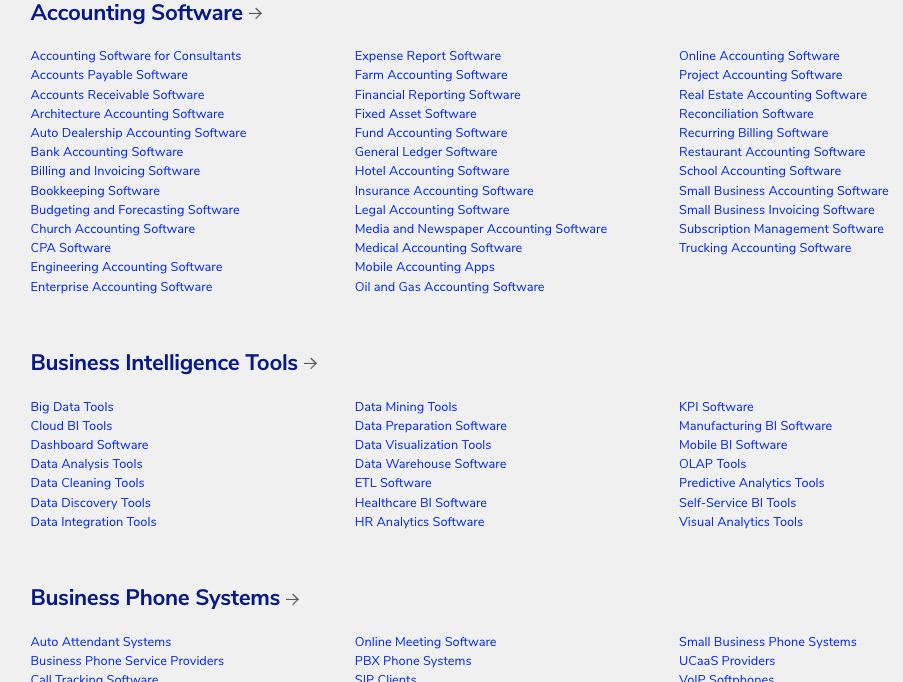
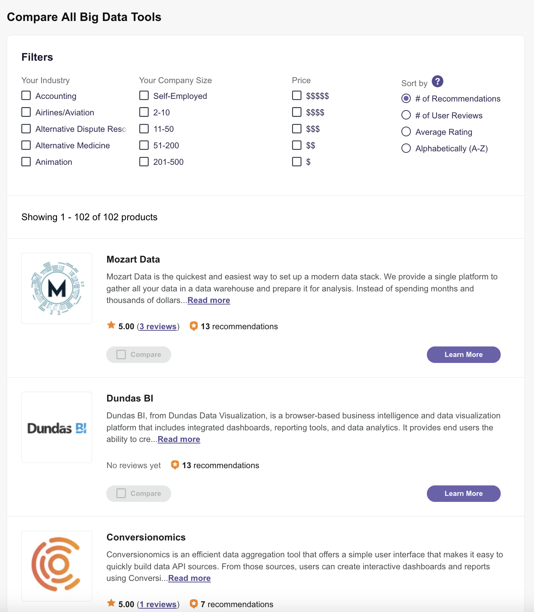
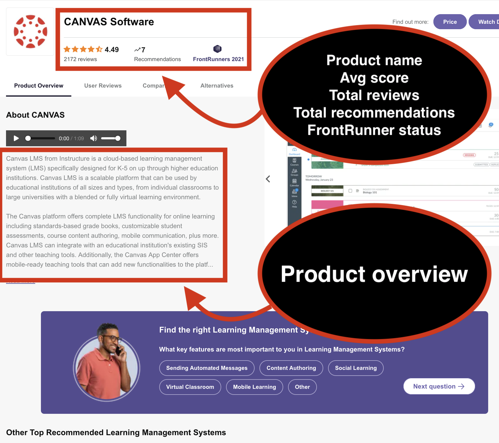
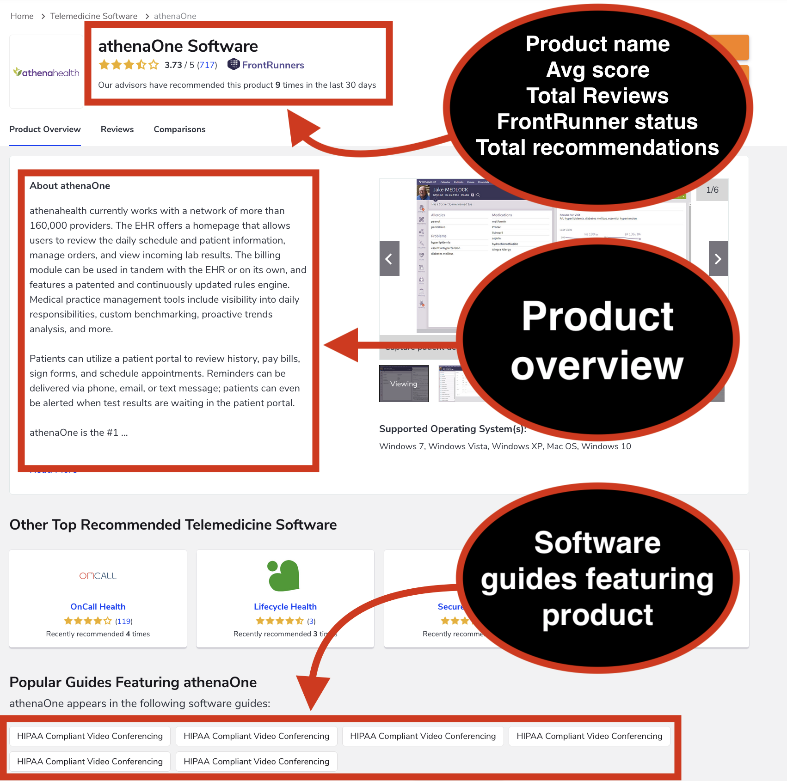

# A Beautiful Soup web scraper to scrape product pages at softwareadvice.com.

 

## Technologies Used

* Python
* Beautiful Soup
* Pandas
* MongoDB
* Jupyter Notebook

 

## Overview

### The script uses Beautiful Soup to gather the data listed below from each product page at softwareadvice.com.  The data is saved to a Pandas DataFrame, a csv file, and can also be saved in a MongoDB database.

* Product name
* Product overview
* Average score
* Total reviews
* Total recommendations
* If product was ever a "FrontRunner"
* List of guides product has been featured in

 

## Data

###  Softwareadvice.com has descriptions, reviews, and other data about software in over 40 categories including Accounting, Business Intelligence, Human Resources, Learning Management Systems, Medical, and Supply Chain Management.  Within each category is a number of subcategories and in each subcategory a number of software products.  There's over 900 subcategories total and up to hundreds of products in each subcategory.

 

#### Categories page

 

#### Subcategory page example (Big Data with 102 product pages)

 

#### Product page example 1

 

#### Product page example 2 

 

## Next Steps

### Next steps for this project would include letting the script gather more data from the product pages (like pricing data although the site doesn't seem to include much pricing data right on the product pages), applying some text cleaning techniques to the product overviews, and writing functions to scrape specified pages by category, subcategory or individual product.

 
